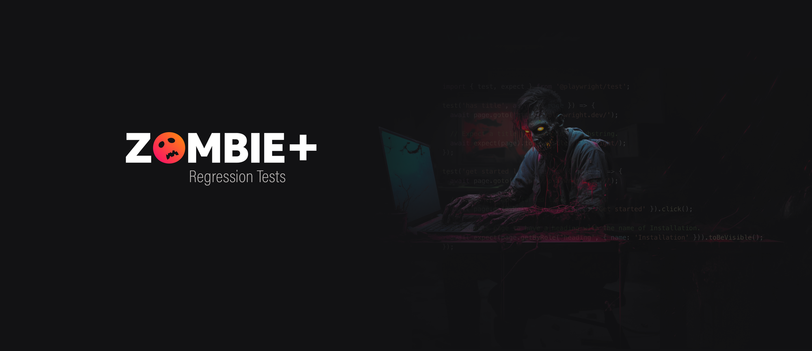

# Playwright E2E Test Project for ZombiePlus 
	
This project is an automated test suite for ZombiePlus, a zombie-themed movie and series streaming service. The tests are written using Playwright, an end-to-end testing framework for web applications.
It is the result of the Playwright Zombie Edition course held at [QaXperience](https://qaxperience.com).

## Table of Contents

- [Test Reports](#test-reports)
  - [Known Bugs](#known-bugs)
- [Playwright Project Configuration:](#playwright-project-configuration)
- [Testing Coverage:](#testing-coverage)
  - [Smoke Tests](#smoke-tests)
  - [Special Character](#special-character-testing-for-movies)
- [Tech Stack and Their Roles](#tech-stack-and-their-roles)
- [Project Structure:](#project-structure)
- [Page Objects and Componentization:](#page-objects-and-componentization)
- [API Requests and Database Queries:](#api-requests-and-database-queries)
- [Mutex:](#mutex)
- [Test Data:](#test-data)
  - [Creating and Maintaining Test Data](#creating-and-maintaining-test-data)
  - [AI-Assisted Test Data Generation](#ai-assisted-test-data-generation)
- [Test Execution:](#test-execution)
  - [ZombiePlus Access:](#zombieplus-access)
- [Feedback and Questions](#feedback-and-questions)

## Test Reports
Test reports for this project are available on the GitHub page of the project at the following link: https://github.com/ecureuill/zombieplus-playwright. 

These reports provide detailed information about the results of each test, including any errors or failures that occurred during testing.

### Known Bugs
The following bugs were identified during testing and are being tracked in the project's issue tracker:

1. Long Title Validation Failure:
    - **Test**: Should not add movie with long title
    - **Description:** Attempting to create a movie with a title exceeding the allowed character limit results in an unexpected behavior.
2. Long Overview Validation Failure:
    - **Test**: Should not add movie with long overview
    - **Description:** Attempting to create a movie with a overview exceeding the allowed character limit results in an unexpected behavior.
3. Insufficient Special Character Validation:
    - **Test 1**: Should filter movie with special character title Test Movie with tab \t
    - **Test 2**: Should filter movie with special character title Test Movie with right-to-left mark \u200F
    - **Description**: The system failed to filter movies containing special characters in their titles.

## Playwright Project Configuration
In a Playwright test suite, project configuration is done using the `playwright.config.js` file. This file contains settings that affect how the tests are run and how the results are reported.

In this project, we have two separate projects defined within our Playwright configuration: `e2e tests` and `e2e home page tests`.

The reason for having separate projects is due to the fact that the tests in the home page alter the state of the database tables (movies, tvshows, and leads). To avoid any potential conflicts or race conditions, these tests are run separately from the rest of the tests. The `fullyParallel` property is set to `false` to ensure that the projects are run sequentially, not in parallel.

This configuration ensures that our tests are run in a controlled and predictable manner, minimizing the risk of unexpected behavior due to concurrent database modifications.

## Testing Coverage
This project aims to achieve comprehensive testing coverage for the ZombiePlus application.

1. Home Page
    - Test the display of featured movies / tvshows on the home page.
    - Test successful lead creation with valid details. (smoke)
    - Test unsuccessful lead creation with duplicate email.
    - Test unsuccessful lead creation with invalid data (blank name and/or email; invalid email).
1. Admin Login Page
    - Test successful login with valid credentials. (smoke)
    - Test unsuccessful login with invalid credentials. (smoke)
    - Test unsuccessful login with empty credentials (blank password and/or email; invalid email).
1. Movies Page
    - Test successful movie creation with valid details.(smoke)
    - Test successful movie creation with special characters.
    - Test unsuccessful movie creation with duplicate title.
    - Test unsuccessful movie creation without required details.
    - Test successful movie deletion. (smoke)
    - Test successful movie search with existing title. (smoke)
    - Test successful movie search with special characters.
    - Test unsuccessful movies search with non-existing title.
1. TV Shows Page
    - Test successful tv shows creation with valid details. (smoke)
    - Test unsuccessful tv shows creation with duplicate title.
    - Test unsuccessful tv shows creation without required details.
    - Test successful tv shows deletion. (smoke)
    - Test successful tv shows search with existing title. (smoke)
    - Test unsuccessful tv shows search with non-existing title.
1. Leads Page
    - Test successful lead deletion. (smoke)
    - Test successful lead search with existing email. (smoke)

### Smoke Tests
In this project, we use the tag `@smoke` to define smoke tests. **Smoke tests** are a subset of the test suite that are designed to quickly verify that the basic functionality of the application is working correctly. They are often used as a first step in the testing process to catch any major issues before more detailed testing is performed.

### Special Character Testing for Movies

This project includes comprehensive tests that specifically focus on how the application handles movies with titles containing special characters. These tests cover a wide range of scenarios, including:

* Creating movies and TV shows with titles containing common special characters (e.g., @, #, $, %, &, !, *).
* Creating movies and TV shows with titles containing non-breaking spaces and other unusual characters.
* Searching for movies and TV shows with titles containing special characters.
* Verifying that special characters are displayed correctly in the UI.
* Verifying that special characters are stored correctly in the database.

These tests help ensure that the application can handle a wide range of input data and that special characters do not cause any unexpected behavior.


**Examples of tested special characters:**

- Emoji: 🧟
- Extended ASCII characters: `Æ Ð Þ ñ ô`
- Newline character: `\n`
- Non-breaking space:  
- Right-to-left mark: `\u200F`
- SQL special character: `
- HTML escape character: `<`
- Japanese characters: `テスト映画`


## Tech Stack and Their Roles
- **Playwright**: A versatile library tailored for browser automation with a focus on reliability.
- **TypeScript**: A statically typed superset of JavaScript, enhancing code safety and maintainability.
- **PostgreSQL**: A widely used relational database management system for data storage and retrieval.
- **async-mutex**: Library for asynchronous mutual exclusion, ensuring synchronized access to shared resources like the database.

Each technology plays a crucial role in the project:

- **Playwright** facilitates efficient and reliable automation of web application interactions.
- **TypeScript** enforces type safety and improves code readability, reducing potential errors.
- **PostgreSQL** provides a robust and scalable data storage solution for the test environment.
- **async-mutex** guarantees controlled access to the database, preventing race conditions and data conflicts.

## Project Structure
The project adopts a structured approach to maintainability and scalability. Here's an overview of the project's directory structure:

```
zombieplus-playwright/
├── fixtures/
│   ├── utils
│   │   ├── Api.ts
│   │   ├── db.ts
│   │   └── data.model.ts
│   ├── data/
│   │   ├── covers/
│   │   │   ├── movies/
│   │   │   └── tvshows/
│   │   ├── leads.json
│   │   ├── login.json
│   │   ├── movies.json
│   │   └── tvshows.json
├── tests/
│   ├── components/
│   │   ├── ModalComponent.ts
│   │   └── ...
│   ├── pages/
│   │   ├── HomePage.ts
│   │   └── ...
│   ├── e2e/
│   │   └── home.spec.ts
│   │   └── ... 
├── playwright.config.js
├── node_modules/
├── package.json
├── tsconfig.json
└── ...
```

- **fixtures**: Stores reusable data and utility functions for test setup and execution.
- **tests**: Houses the actual test code, organized by components, pages, and specific features.
- **playwright.config.js**: Defines project-specific configuration for Playwright test execution.
- **node_modules**: Contains externally installed dependencies required by the project.
- **package.json**: Manages project metadata and dependencies.
- **tsconfig.json**: Configures TypeScript compilation and settings.

## Page Objects and Componentization
This project follows the Page Object Model (POM) design pattern. In POM, each page is represented by a class, and interactions with the page are encapsulated in the methods of that class.  This approach enhances the test code's:

- **Readability**: Clear object-oriented representation of pages and actions.
- **Reusability**: Shared page objects across tests, reducing code duplication.
- **Maintainability**: Modifications to page elements or interactions localized within the page object class.

In addition, this project makes extensive use of components, which are classes that encapsulate the interaction logic with specific parts of a page. For example, we have components for the search bar, the header, and the leads table. This further improves:

-  **Modularity**: Breaking down complex interactions into smaller, reusable components.
-  **Testability**: Isolating component behavior for focused testing.

## API Requests and DataBase queries

The database state is cleaned to ensure a consistent testing environment before each test. This is done using the `pg` package to interact directly with the PostgreSQL database.

In addition, some tests insert records into the database using the ZombiePlus API. This allows the tests to run quickly, without the need to interact with the user interface.

## Mutex
A mutex (or mutual exclusion) is used in this project to ensure that only one test can interact with the database at a time. This is necessary to avoid race conditions if multiple tests try to change the database at the same time.

## Test Data

The test data for this project is stored in separate files for each feature of the application. For example, the data for creating, deleting, and searching for leads is stored in the leads.json file, while the data for registering and managing movies is stored in the movies.json file.

Using separate files for each feature has several advantages. It makes the tests easier to write and maintain, as the test data can be updated in a single location for each feature. It also allows the tests to be run with a variety of data, which can reveal bugs that would not be discovered otherwise.

Moreover, this approach allows us to simulate different user behaviors and scenarios more realistically, contributing to more robust and reliable tests.

### Creating and Maintaining Test Data:

Test data creation involves identifying various use cases and edge cases relevant to each feature. Data is carefully crafted to represent expected user behavior, potential errors, and boundary conditions. The use of JSON files allows for easy editing and version control, facilitating updates as the application evolves.

By diligently maintaining and expanding the test data set, we ensure comprehensive coverage of various user interactions and system responses, strengthening the overall quality and reliability of the automated test suite.

### AI-Assisted Test Data Generation

This project leverages the power of artificial intelligence (AI) to create and augment test data. Specifically, we utilize the capabilities of Gemini and ChatGPT to generate realistic and diverse data sets, including generate images for movie and TV show titles.

#### Benefits of AI-Assisted Test Data Generation:
- Increased Efficiency: AI-powered tools can significantly reduce the time and effort required to create and maintain test data.
- Enhanced Data Diversity: AI can generate a wider range of data than manual methods, covering a broader spectrum of use cases and edge cases.
- Improved Data Quality: AI tools can help identify and eliminate inconsistencies and errors in test data, ensuring higher data quality.

## Test Execution
Following are the steps to clone and run this project:

```bash
# 1. Clone the project repository from GitHub:
git clone https://github.com/ecureuill/zombieplus-playwright.git
# 2. Navigate to the cloned directory:
cd zombieplus-playwright
# 3. Install the required dependencies:
# 4.
cat > .env << EOF
DB_HOST=[REPLACE IT WITH YOUR DATA BASE HOST URL]
DB_NAME=[REPLACE IT WITH YOUR DATA BASE NAME]
DB_USER=[REPLACE IT WITH YOUR DATA BASE USER]
DB_PASS=[REPLACE IT WITH YOUR DATA BASE PASSWORD]
DB_PORT=[REPLACE IT WITH YOUR DATA BASE PORT]

API_HOST=http://localhost:3333
API_USER=admin@zombieplus.com
API_PWD=pwd123

FRONT_HOST=http://localhost:3000
EOF
# 5. Run the tests
npx playwright test
```
> **Important:** Replace the placeholder values with your actual credentials and API endpoints. Do not commit the `.env` file to a public repository.

That's it! The tests will now run and you will see the results in your terminal.

Please note that you need to have Node.js and npm installed on your machine to run this project. If you don't have them installed, you can download and install them from the official Node.js website.

### ZombiePlus Access
ZombiePlus system is not publicly available. This project is intended to be used by those who have access to the ZombiePlus system provided in the QaXperience course. If you do not have access to this system, you will not be able to run the tests in this project.

## Feedback and Questions

I'm still learning test automation, so I'd appreciate your feedback and questions on this project. Your insights will help me improve my skills and understanding of Playwright and E2E testing.

Please feel free to leave a comment on the project's GitHub page or reach out to me directly.

I'm always looking for ways to improve my skills and knowledge, and I value your input. Thank you for your time and consideration!